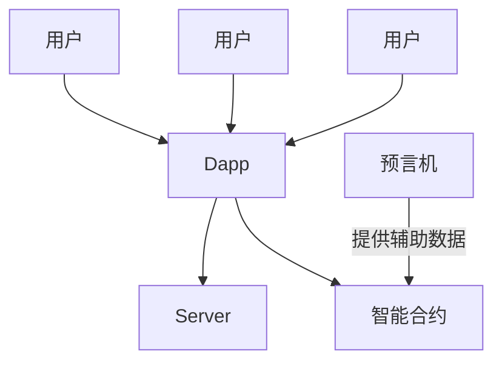

# Web3 开发者需要用到的工具和技术

作为一名 web3 开发者在开发中必须要使用和掌握的技术和工具

## Web3 和 Dapp

广义的 Web3 的定义很宽泛, 是一种可读, 可写, 可拥有的互联网, 涵盖了区块链, AI, 大数据, 分布式系统, 去中心化自治组织(DAO), 元宇宙等, Dapp 应用只是其中之一, 而狭义的 web3 差不多就等同于 Dapp 应用

Dapp 是 web3 范畴的产品, 也就是去中心化应用, 使用了区块链技术来达成去中心化

## Dapp 系统架构

### 第一部分: Dapp

运行在浏览器里的 web 应用, 等于 web2 的前端, 但需要对接智能合约

### 第二部分: Server

和传统 web server 差不多, 与 Dapp 交互, 负责数据库读写, 提供和处理数据, 以及一些业务逻辑的处理

### 智能合约

智能合约是运行在区块链上的一段二进制代码, [以太坊](https://ethereum.org/)上的智能合约通常用 Solidity 开发, 编译后上传到[以太坊](https://ethereum.org/)的 EVM 区块链上运行, 又称作链端, 可供 Dapp 调用

### 预言机

涉及到一些 Dapp 的特殊场景, 需要一些辅助的数据才能完成整个工作的闭环, 此时则需要预言机或 Graph 等提供数据, 如赌球的场景需要预言机提供比赛结果到智能合约

## 开发所需工具

### Metamask

官网访问地址: [https://metamask.io]()

小狐狸钱包(Metamask)是 web3 从业者必备工具之一, 它提供了管理数字资产所需的一切功能

Metamask 是一个浏览器插件, 大部分主流浏览器都能安装使用

[如何用 metamask 创建你的 web3 身份](https://zhj13.top/2022/04/15/Web3/create-web3-identity/)

### Ganache 个人区块链

官网下载地址: [https://trufflesuite.com/ganache]()

对开发者来说, 开发和调试程序时不可能在真实环境中进行, 因为区块链操作都需要消耗金钱, 而且也不安全

为解决这个痛点, Ganache 应运而生, 它模拟了以太坊主链的所有功能, 可以快速搭建一个本地区块链, 为开发者提供了一个近似的环境调试程序

### Remix 编译工具

官网访问地址: [https://remix.ethereum.org]()

Remix 是智能合约编译部署工具, 可以将 Solidity 开发的智能合约编译成二进制代码并上传到区块链

Remix 可以在线使用, 无需安装, 并且非常简单直观

### Truffle 和 HardHat 集成化环境

官网访问地址: [https://trufflesuite.com]()
官网访问地址: [https://hardhat.org]()

这两个工具都提供了 DAPP 开发, 测试和部署的集成化环境, Ganache 就是 Truffle 的套件之一, 其中 HardHat 的集成度更高更受欢迎

## 开发所需技术

### web3.js, ethers.js, viem

web3.js 是早期最受欢迎的用于与以太坊交互的 js 库, 它由 Ethereum 官方团队及社区共同维护, 通过 JSON-RPC 调用读取链上数据或发送交易

ethers.js 相比 web3.js 是一个更轻量, 模块化且类型安全的 js 库, 算是 web3.js 的替代品

Viem 是由 Wagmi 团队开发的较新的以太坊 RPC 客户端库, 同样轻量, 模块化且类型安全, 旨在成为 ethers.js 和 web3.js 之后更高效, 模块化的 RPC 调用解决方案

| 特性       | web3.js                    | ethers.js                | viem                               |
| ---------- | -------------------------- | ------------------------ | ---------------------------------- |
| 诞生时间   | 较早, 较为成熟             | 较晚, 后起之秀           | 最新, 专注现代化                   |
| 体积       | 较大                       | 轻量, 模块化设计         | 极致轻量, 按需导入                 |
| 类型支持   | 较弱                       | 优秀的 TypeScript 支持   | 顶尖 TypeScript 支持               |
| API 设计   | 相对复杂, 历史包袱较多     | 简洁现代, 易用           | 极简且灵活, 专注底层 RPC           |
| 主要用途   | 全功能, 全面, 传统项目     | dApp 开发, 现代工具      | 性能优先, 构建高阶库的底层基础     |
| 社区活跃度 | 稳定, 维护稍显缓慢         | 活跃, 更新频繁           | 新兴, 快速发展中                   |
| 适用范围   | 兼容旧版项目, 学习门槛较高 | 新项目首选, 良好开发体验 | 高级开发者和想构建自定义框架的团队 |

### web3-react.js

web3-react 是一个基于 react hooks, 提供钱包, 账户,网络,事件订阅等状态管理功能, 提供连接器(connectors)来连接多种钱包, 可以在 react 项目中快速集成登录,认证和状态同步的场景

### wagmi

将 viem 作为底层 RPC 驱动, 且基于 react 封装的 react hooks 库, 是现在 React Dapp 开发首选工具

主要特点

- React Hooks: 提供便捷的 hooks, 如 useAccount, useConnect, useContractRead, useContractWrite, 极大提升开发体验
- 钱包连接支持: 内置对 MetaMask, WalletConnect, Coinbase Wallet 等多钱包接入支持
- 基于 Viem: 以 Viem 作为底层 RPC 客户端, 享受其类型安全和性能优势
- 封装繁琐接口, 优雅管理异步状态, 错误处理和缓存
- 与 React 生态兼容: 可以轻松结合 React Query, Zustand 等状态管理及查询库

## rainbowkit

rainbowkit 是一个 react 组件库, 专注于为以太坊 dApp 提供漂亮且用户友好的钱包连接体验, 能够极大地简化钱包集成过程

rainbowkit 是构建在 wagmi 之上的 UI 库, 它通过 wagmi 提供的 react hooks 来管理钱包, 账户, 状态等
